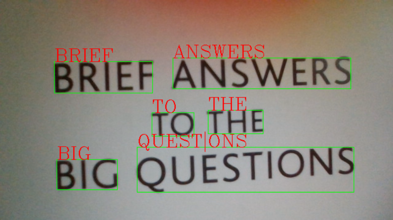

# What it is
+ text_detection in real time through a webcam.

# How to use
+ [DownLoad](https://tesseract-ocr.github.io/tessdoc/Downloads.html) Tesseract ocr
+ Load main.py

# Image

### reference 
+ http://docs.opencv.org/3.0-beta/doc/py_tutorials/py_gui/py_video_display/py_video_display.html
